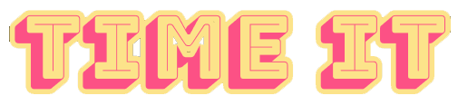

# time-it
<p align="center">
   <br />
  A free time tracker for your work tasks. <br /> <br />
  
</p>

## Info
This is the landing page for a software product I designed using CSS flexbox. Feel free to use it for your own product too, as long as you credit this repository.

## Fonts

```css
@import url('https://fonts.googleapis.com/css2?family=Bungee+Shade&family=Dawning+of+a+New+Day&family=Jura:wght@300;400;500;600;700&family=VT323&display=swap');
font-family: 'Bungee Shade', cursive;
font-family: 'Dawning of a New Day', cursive;
font-family: 'Jura', sans-serif;
font-family: 'VT323', monospace;
font-family: 'PrimaSans';
```

## Colors
- #FC5185 pink
- #364F6B blue
- #3FC1C9 light blue
- #FCE38A yellow

## Illustration & Icons
- https://www.figma.com/community/file/883778082594341562
- https://www.figma.com/community/file/800815864899415771

## Media and Outreach
- this twitter account is not taken yet https://twitter.com/timeit_
- get a domain

## To-do
- build it first in angular and forget about adding electron
- add CTA button to hero
- fix selection colors all over the page
- recognize the background color as a new part of color palette
- add color variable declarations
- add dark mode switch to navbar
- consider making the download icons smaller 
- fix hero whitespace
- add responsive behavior
- consider looking at https://counter.dev/ for features inspirations
- consider this component library https://taiga-ui.dev/components/theme-switcher (theme switching)
